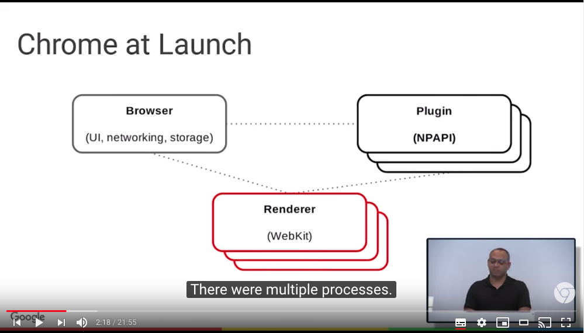
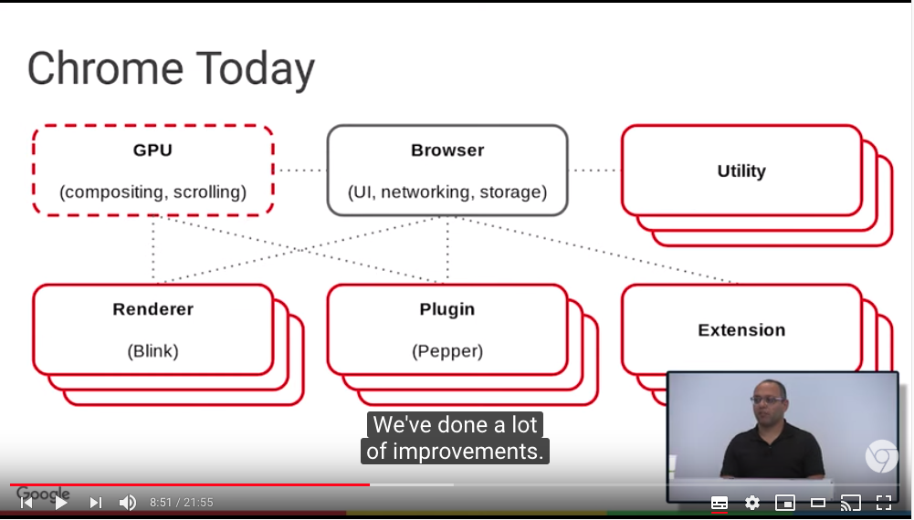
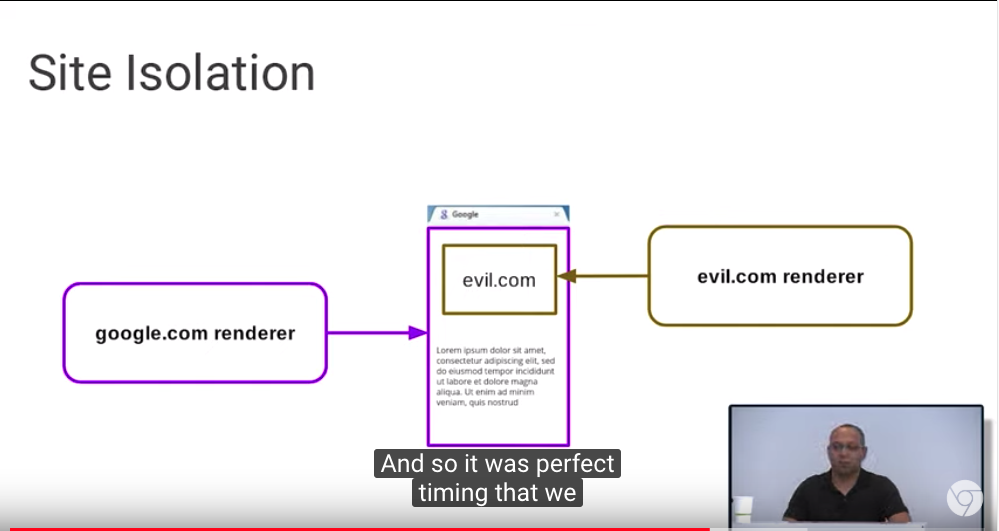

[Anatomy of the browser 101](https://www.youtube.com/watch?v=PzzNuCk-e0Y&list=PLNYkxOF6rcICgS7eFJrGDhMBwWtdTgzpx)
=====

### Overview
- Chromeのcore principles
  - speed
  - security
  - simplicity
  - stability

### アーキテクチャの変遷
####  Before Chrome
- すべての処理(レンダリングエンジン、ネットワーク、ストレージ、etc.)が1プロセスに

#### Chrome 1.0

- 複数のプロセスに分かれている
  - 1個のBrowserプロセス
  - 複数のレンダラープロセス
  - 複数のPluginプロセス
- なぜマルチプロセスか？
  - 完璧なコードなんて書けないから。完璧なコードが書けないと...
  - security: バグを悪用されてさまざまなことができてしまうと困る（ファイルシステムへのアクセスなど）
  - speed: 
  - stability
- IPC
  - inter-process communication
- Sandboxing
  - 信頼できないコンテンツを安全に実行するために、ファイルシステムやOSのシステムコールにアクセスできないプロセスを用いる
- Rendererプロセス
- Pluginプロセス
  - ローンチした当時のブラウザプラグインが動作する必要があった
    - NPAPI = Netscape Plugin Application Programming Interface
  - Flash, Java, Adobe Reader などの実行
  - プラグインはフル権限を想定して作られていたため、sandbox化できなかった
- Browserプロセス
  - 中心に位置し、全体をコーディネートする役割
  - ネットワークのハンドリング、UI描画
- Threads

#### 現在のChrome

- プロセスの種類が増えた
  - GPU, Utility, Extension
- GPU
  - WebGLだったり、compositingやscrollingをGPUに任せる大きなプロジェクトとかで使われる
- Utility
  - extensionのインストールやJSONの処理などを行う
  - 短命
- リアーキテクチャ: chrome/content split
  - プロダクト(Chrome)とプラットフォーム(sandboxed multi-process browser)を分離した
  - src/chromeをsrc/chromeとsrc/contentに分け
    - src/chromeはUIと、ブックマークやパスワードマネージャなどのブラウザの機能に関係するものに
    - src/contentはマルチプロセスやsandboxに関係するものに
- リアーキテクチャ2: Componentization
  - SafariのようにBlinkを使ってないブラウザに
- Site Isolation
  - タブ内も、originごとにrendererプロセスを分けるように
  - セキュリティ向上

- Mojo
  - 新しいIPCメカニズム

### 将来のChrome

- Servicification
  - いわゆるマイクロサービス化
- speed, security, stability, simplicityの観点で以下のメリットがある
  - speed: fewer conversions, subsystems running closer to callers
  - security: sandbox化が進む
  - stability: より細かくサービスに分割されることにより、browserプロセスで実行されるコードが減る
  - simplicity: reduce boundaries, fewer duplicate APIs
  - speedとsimplicityはあまりピンとこなかった

### Map

Chromeのソースコードを読み進めるための地図、の意味だと思われる。

